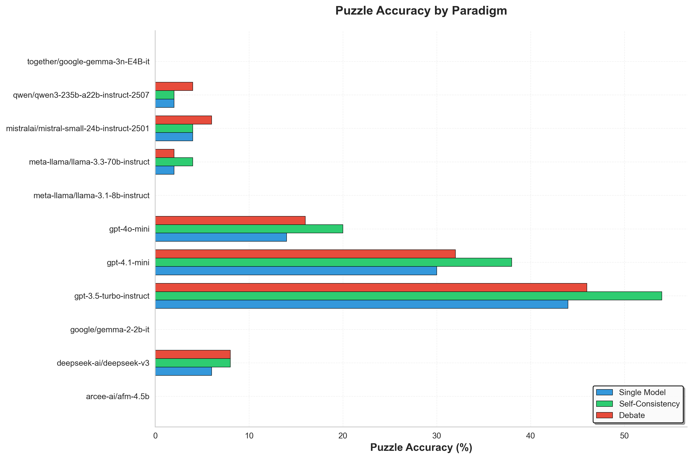
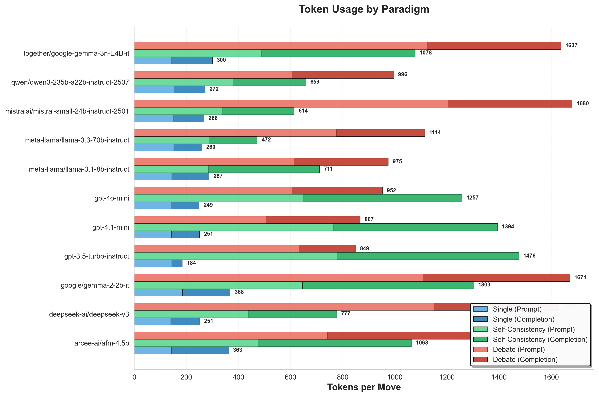
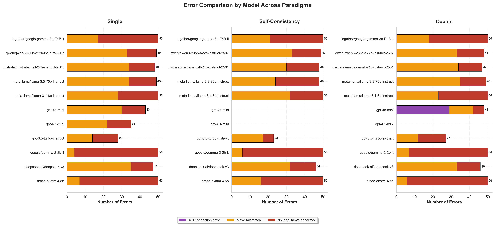
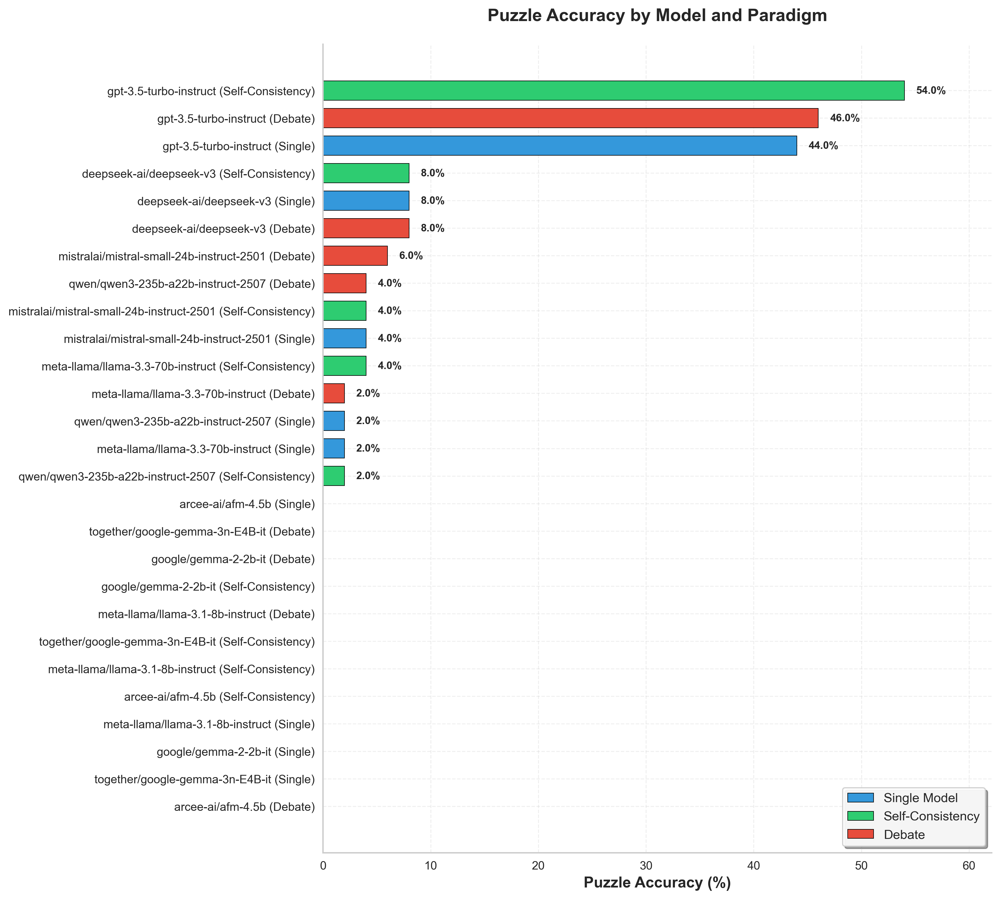
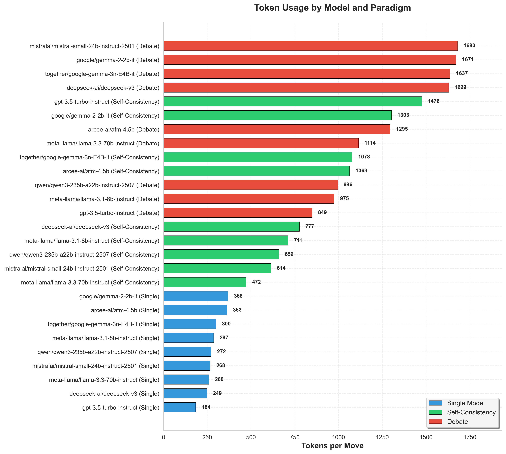

# Self-Consistency Enhanced Chess Agents for Full Chess Games

A Python framework for evaluating chess puzzles and full games using multiple LLM paradigms (single model, self-consistency, and multi-agent debate) across various models. This project extends beyond single-move evaluation to assess complete puzzle sequences and full game play.

## Final Paper

**["Self-Consistency Enhanced Chess Agents for Full Chess Games"](Final_report.pdf)**  

Key findings:
- Self-consistency (SC) substantially outperforms multi-agent debate (MAD): 54% vs. 46% puzzle accuracy with lower token costs
- Model quality trumps parameter count (GPT-3.5-Turbo-Instruct shows unusually strong chess performance)
- Only 12% board state grounding despite strong moves, suggesting pattern-matching over explicit reasoning

## Project Overview

This project evaluates LLMs on chess puzzles and full games using three paradigms:

1. **Single Model**: Direct query to a single model
2. **Self-Consistency (SC)**: Three independent queries with divergent play-styles (aggressive, positional, neutral) using majority voting
3. **Multi-Agent Debate (MAD)**: Two-agent debate system with moderator/judge

### Key Improvements Over Single-Move Evaluation

Unlike [kagisearch/llm-chess-puzzles](https://github.com/kagisearch/llm-chess-puzzles), which only checks if a single move is correct, this system:

- **Evaluates complete puzzle sequences**: Models must correctly predict all moves in a sequence to solve the puzzle
- **Automatic move execution**: After each correct move, the system plays the next move from the solution, creating realistic game progression
- **Full game capabilities**: Can play complete games, enabling evaluation of strategic coherence and endgame play
- **Planning integration**: Supports multi-ply planning to assess forward-thinking capabilities

## Quick Setup

1. **Install dependencies**:
   ```bash
   pip install -r requirements.txt
   ```

2. **Set up API keys** (create `.env` file):
   ```env
   OPENAI_API_KEY=your-openai-key-here
   ANANNAS_API_KEY=your-anannas-key-here
   ANANNAS_API_URL=https://api.anannas.ai/v1
   ```

3. **Run minimal test**:
   ```bash
   python test_minimal.py
   ```

## Basic Usage

### Puzzle Evaluation

```bash
# Single model
python main.py --evaluate --max-puzzles 10

# Self-consistency
python main.py --evaluate --max-puzzles 10 --self-consistency

# Debate
python main.py --evaluate --max-puzzles 10 --debate
```

### Full Games

```bash
cd chess_game_engine
python chess_game.py --save-pgn
```

### Generate Graphs

```bash
cd scripts
python graph_all_paradigms.py
```

**For detailed command options and advanced usage, see [ADVANCED_USAGE.md](ADVANCED_USAGE.md).**

## Results

### Paradigm Comparison Graphs

**Puzzle Accuracy by Paradigm**


**Move Accuracy by Paradigm**


**Token Usage by Paradigm**


**Error Comparison Across Paradigms**


### Sorted Performance

**Puzzle Accuracy (Sorted)**


**Token Efficiency (Sorted)**


## Data Structure

All data is centralized in `data/`:
- `data/input/`: Puzzle datasets (CSV)
- `data/test_results/`: Results by paradigm (`single_50/`, `self_consistency_50/`, `debate_50/`)
- `data/graphs/`: Generated visualizations
- `data/games/`: Full game files (PGN/JSON)

## Models Evaluated

- GPT-3.5-turbo-instruct, GPT-4o-mini, GPT-4.1-mini (OpenAI)
- deepseek-ai/deepseek-v3
- meta-llama/llama-3.1-8b-instruct, meta-llama/llama-3.3-70b-instruct
- mistralai/mistral-small-24b-instruct-2501
- qwen/qwen3-235b-a22b-instruct-2507
- arcee-ai/afm-4.5b, google/gemma-2-2b-it, together/google-gemma-3n-E4B-it

## Data Source

Puzzles from the [Lichess Open Database](https://database.lichess.org/#puzzles) (5.4M+ rated puzzles).

Methodology based on:
- [Chess LLM Evaluation](https://nicholas.carlini.com/writing/2023/chess-llm.html) by Nicholas Carlini
- [More Chess Analysis](https://dynomight.net/more-chess/) by Dynomight

## Documentation

- **[ADVANCED_USAGE.md](ADVANCED_USAGE.md)**: Detailed command options and advanced usage patterns
- **[chess_game_engine/README.md](chess_game_engine/README.md)**: Full game engine documentation
- **[chess_game_engine/TOURNAMENT_README.md](chess_game_engine/TOURNAMENT_README.md)**: Tournament system documentation

## License

See [LICENSE](LICENSE) file for details.
