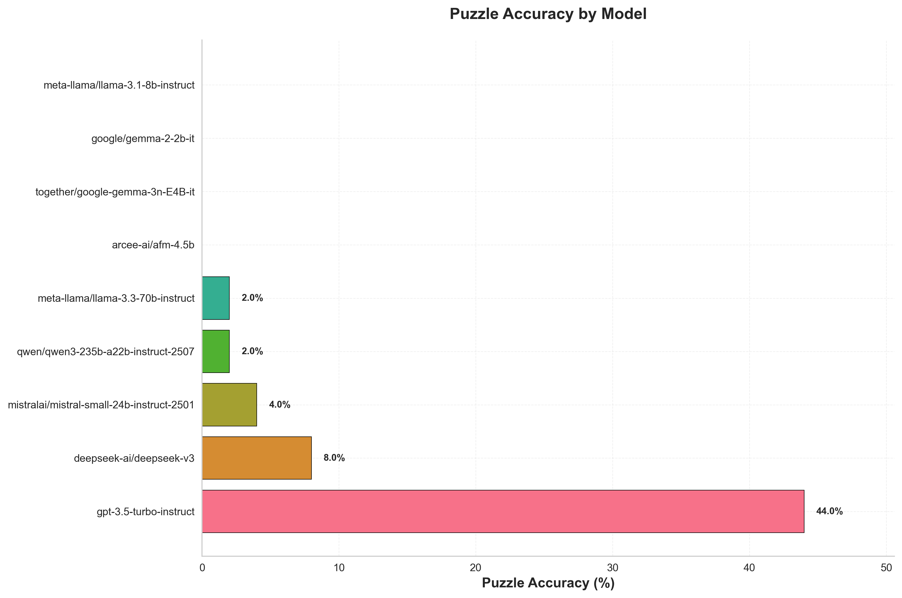
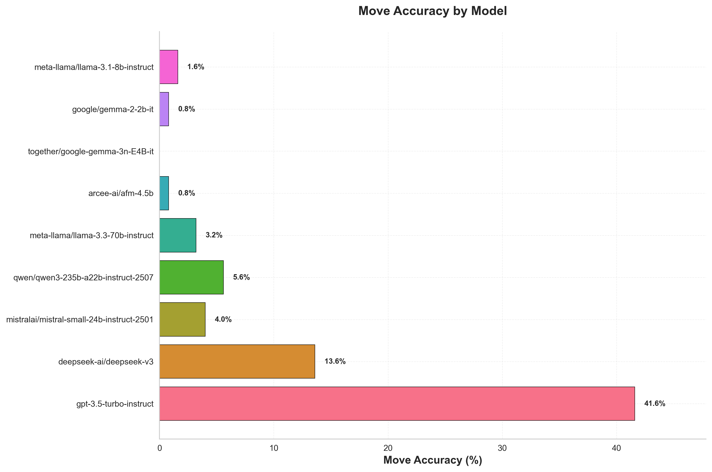
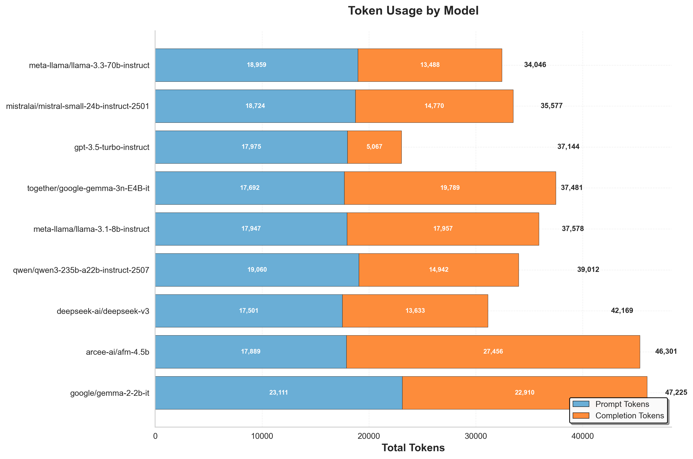
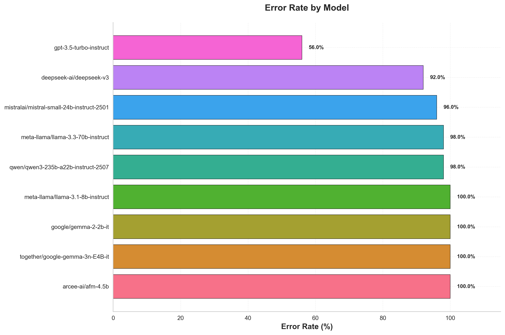

# Model Testing Log

## Results Summary

### Performance Graphs

#### Paradigm Comparison

#### Single Model Performance

---

## Puzzle 0 Testing Results (2024-11-14)

### Summary
Tested 26 models (1 free + 25 low-cost open-source models) on puzzle 0 to identify which models can solve even an easy puzzle.

### Results

**✅ Models that solved puzzle 0:**
- `mistralai/mistral-small-24b-instruct-2501` - 1/1 correct moves

**❌ Models that failed puzzle 0 (25 models):**
- `together/ServiceNow-AI-Apriel-1.5-15b-Thinker` (FREE)
- `arcee-ai/afm-4.5b`
- `together/google-gemma-3n-E4B-it`
- `google/gemma-2-2b-it`
- `mistralai/mistral-7b-instruct-v0.3`
- `google/gemma-2-9b-it-fast`
- `qwen/qwen2.5-coder-7b`
- `meta-llama/llama-3.1-8b-instruct-fast`
- `together/meta-llama-Llama-3.2-3B-Instruct-Turbo`
- `openai/gpt-oss-20b`
- `together/meta-llama-Meta-Llama-3-8B-Instruct-Lite`
- `together/arize-ai-qwen-2-1.5b-instruct`
- `together/nvidia-NVIDIA-Nemotron-Nano-9B-v2`
- `openai/gpt-oss-120b`
- `together/arcee_ai-arcee-spotlight`
- `together/marin-community-marin-8b-instruct`
- `meta-llama/llama-3.1-8b-instruct`
- `together/meta-llama-Meta-Llama-3.1-8B-Instruct-Turbo`
- `qwen/qwen3-30b-a3b-instruct-2507`
- `qwen/qwen3-32b`
- `mistralai/mistral-7b-instruct-v0.2`
- `together/togethercomputer-Refuel-Llm-V2-Small`
- `qwen/qwen2.5-vl-72b-instruct`
- `together/Qwen-Qwen3-235B-A22B-Instruct-2507-tput`
- `qwen/qwen3-235b-a22b-instruct-2507`

### Key Findings

1. **Only 1 out of 26 models solved puzzle 0**: `mistralai/mistral-small-24b-instruct-2501` ($0.13/1M tokens)

2. **Free models performance**: All free models tested previously failed to solve the first 50 puzzles. The free model tested here (`together/ServiceNow-AI-Apriel-1.5-15b-Thinker`) also failed puzzle 0.

3. **Open-source model limitations**: The vast majority of open-source models (including larger models like Qwen 235B) were unable to solve even an easy puzzle (puzzle 0), suggesting significant challenges with chess reasoning tasks.

4. **Cost vs. Performance**: The successful model (`mistralai/mistral-small-24b-instruct-2501`) is relatively low-cost at $0.13/1M tokens, making it a good candidate for further testing.

### Next Steps

- Test `mistralai/mistral-small-24b-instruct-2501` on the first 50 puzzles to evaluate its performance across a broader set of puzzles.

---

## Follow-up: Mistral Small 24B Performance on 50 Puzzles (2024-11-14)

**Result**: `mistralai/mistral-small-24b-instruct-2501` only solved puzzle 0 (1/50 = 2% accuracy). This suggests that solving puzzle 0 was likely a fluke or the puzzle was particularly easy.

### Promising Models to Test Next

Based on the smoke test analysis, here are models that might perform better:

#### **Reasoning Models** (Highest Priority)
Reasoning models are specifically designed for complex logical tasks and may excel at chess puzzles:

1. **`qwen/qwen3-30b-a3b-thinking-2507`** - $0.40/1M, reasoning tier, 262K context
   - Low cost reasoning model, good balance

2. **`qwen/qwen3-235b-a22b-thinking-2507`** - $1.00/1M, reasoning tier, 262K context
   - Large reasoning model (we tested non-thinking version which failed)

3. **`deepseek/deepseek-r1`** - $2.71/1M, reasoning tier, 128K context
   - DeepSeek R1 is known for strong reasoning capabilities

4. **`deepseek/deepseek-r1-0528`** - $3.20/1M, reasoning tier, 164K context
   - Updated version of DeepSeek R1

5. **`qwen/qwen3-next-80b-a3b-thinking`** - $1.35/1M, reasoning tier, 262K context
   - Mid-size reasoning model

6. **`grok/grok-4-fast-reasoning`** - $0.70/1M, reasoning tier, 2M context
   - Very low cost with massive context window

7. **`arcee-ai/maestro-reasoning`** - $4.20/1M, reasoning tier, 131K context
   - Specialized reasoning model

#### **Strong General Models**

8. **`deepseek-ai/deepseek-v3`** - $2.00/1M, fast tier, 164K context
   - DeepSeek V3 is one of the strongest open-source models

9. **`anthropic/claude-3.7-sonnet`** - $18.00/1M, fast tier, 200K context
   - Claude models are known for strong reasoning (more expensive)

10. **`anthropic/claude-3.5-sonnet`** - $18.00/1M, fast tier, 200K context
    - Strong general model

#### **Code Models** (Sometimes good at structured tasks)

11. **`qwen/qwen3-coder-480b-a35b-instruct`** - $2.20/1M, fast tier, 262K context
    - Very large code model, may handle structured chess notation well

### Recommended Testing Order

1. Start with low-cost reasoning models: `qwen/qwen3-30b-a3b-thinking-2507`, `grok/grok-4-fast-reasoning`
2. Test DeepSeek reasoning models: `deepseek/deepseek-r1`, `deepseek/deepseek-r1-0528`
3. Test larger reasoning models: `qwen/qwen3-235b-a22b-thinking-2507`
4. Test strong general models: `deepseek-ai/deepseek-v3`
5. If budget allows: `anthropic/claude-3.7-sonnet` or `anthropic/claude-3.5-sonnet`

